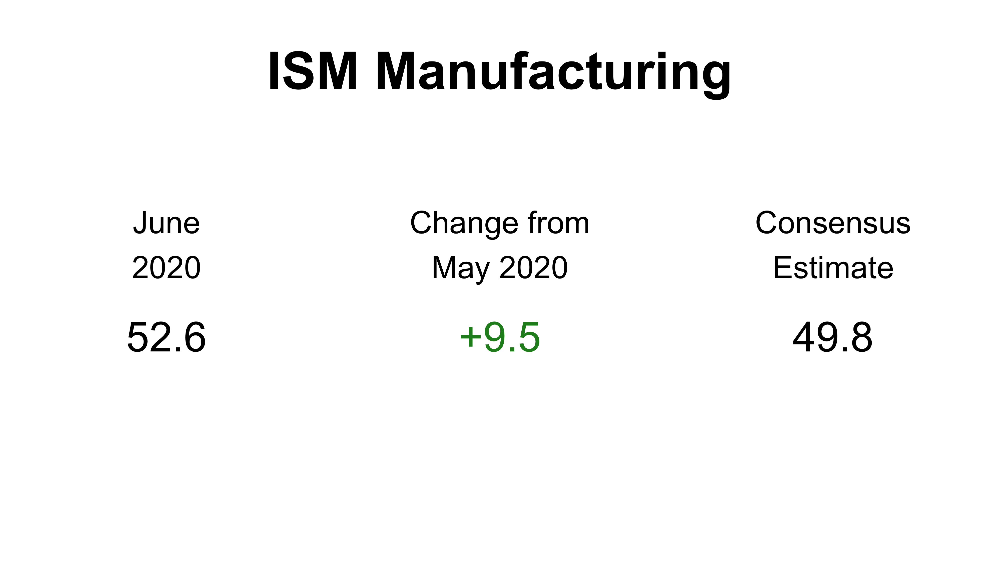

---
output:
  pdf_document: default
  html_document: default
---

```{r setup, include=FALSE}
knitr::opts_chunk$set(echo = TRUE)
```




```{r, echo = FALSE}
load('plots/new-orders-index.rds')
p
```

